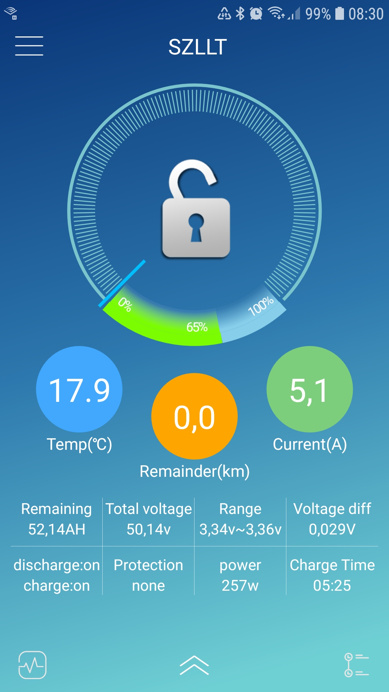
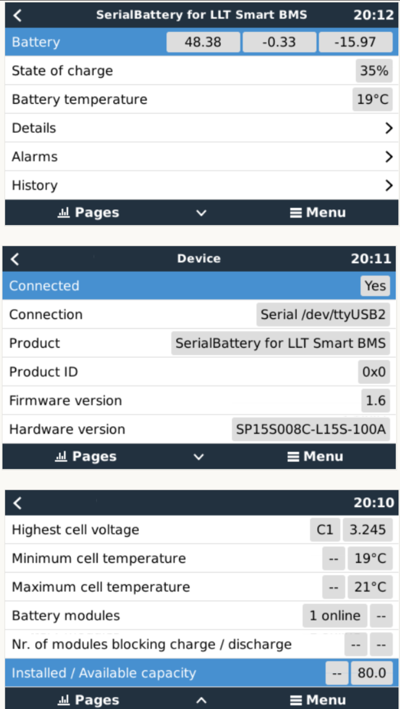
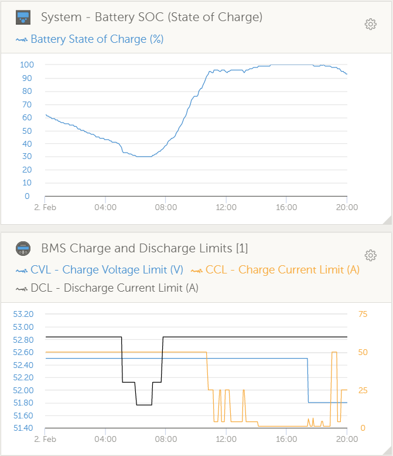

# dbus-serialbattery
This is a driver for VenusOS devices (any GX device sold by Victron or a Raspberry Pi running the VenusOS image). 

The driver will communicate with a Battery Management System (BMS) that support serial communication (RS232 or RS485) 
Modbus RTU type commands and publish this data to the dbus used by VenusOS. The main purpose is to supply up to date State Of Charge (SOC) values
to the inverter, but many extra parameters is also published if available from the BMS.

Driver support:
 * Smart BMS range from [LLT Power](https://www.lithiumbatterypcb.com/product-instructionev-battery-pcb-boardev-battery-pcb-board/ev-battery-pcb-board/smart-bms-of-power-battery/) / [Jiabaida JDB BMS](https://dgjbd.en.alibaba.com/) / Overkill Solar or BMS that use the Xiaoxiang phone app

Planned support:
 * Smart Daly BMS
 * AntBMS

### Features
The driver will act as Battery Monitor inside VenusOS and update the following values:
* State Of Charge
* Voltage
* Current 
* Power
* Can handle batteries with from 3 - 32 cells
* battery temperature
* min/max cell voltages
* raise alarms from the BMS
* available capacity
* history of charge cycles
* set battery parameters
    - Charge Voltage Limit(CVL)
    - Charge Current Limit(CCL)
    - Discharge Current Limit(DCL)
    - CVL (Battery Max) automatically adjusted by cell count * 3.45V
    - Battery Min automatically adjusted by cell count * 3.1V

  
* Charge current control management.
  CCCM limits the charge/discharge current depending on the SOC
    - between 98% - 100% => 1A charge
    - between 95% - 97% => 4A charge
    - between 91% - 95% => 1/2 Max charge
    - else Max charge and Max discharge
      
    - between 30% - 35% => 1/2 Max discharge
    - between 20% - 30% => 1/4 Max discharge
    - below < 20% => 5A

### How to install
1. You need to have a VenusOS device set up and running on your GX system (VenusGX, Cerbo, Raspberry Pi).
2. You also need to connect your BMS to the VenusOS device using a serial interface. Use a Victron branded USB->RS485 or USB->Ve.Direct(RS232) cable for best compatibility. Most FTDI/FT232R USB->serial also works (make sure it is not a fake if you don't want issues). The FT232R already has a driver included in the VenusOS. Only connect the Ground, Rx & Tx to the BMS.
3. [Option] Automatic Installer: Download and copy the [latest release venus-data.tar.gz](https://github.com/Louisvdw/dbus-serialbattery/releases) to the root of a USB flash drive or SD card, plug the flash drive/SD into the Venus device and reboot. It will automatically extract and install to the correct locations and try the driver on any connected devices.  
3. [Option] SSH installer script ( Require [root access](https://www.victronenergy.com/live/ccgx:root_access) ): Log into your VenusOS device and run this script to install the latest version. This can also be used to update to the latest version. 
  > curl -s https://api.github.com/repos/Louisvdw/dbus-serialbattery/releases/latest | grep "browser_download_url.*gz" | cut -d : -f 2,3 | tr -d \\" | wget -qiO - | tar -zxf venus-data.tar.gz -C /data
3. [Option] Manual install ( Require [root access](https://www.victronenergy.com/live/ccgx:root_access) ): 
    

      
Show details

   
      Use an FTP client that support SFTP to copy the driver files to the rooted VenusOS device. The files in the archive have to go into /data/ folder keeping the file structure from the archive as below. [Filezilla](https://filezilla-project.org/) is a good option.
       
      - copy the /etc/dbus-serialbattery folder from the archive to `/data/etc/`
      - copy rc.local to `/data/`
      - copy /conf/serial-starter.d to `/data/conf/`
      - change permissions to allow execute (rwxr-xr-x)
      - reboot your VenusOS device and check if your battery is connected
          
   > chmod 755 /data/rc.local /data/etc/dbus-serialbattery/dbus-serialbattery.py /data/etc/dbus-serialbattery/service/log/run /data/etc/dbus-serialbattery/service/run
   
     

4. The current versions use a hard coded current limit for the BMS (50A charge/60A discharge). If your battery cannot handle that please edit the MAX_BATTERY_CURRENT and MAX_BATTERY_DISCHARGE_CURRENT constants at the top of the file etc/dbus-serialbattery/dbus-serialbattery.py . There is an open [issue](https://github.com/Louisvdw/dbus-serialbattery/issues/4) to fix this. 

### Troubleshoot
There are 2 important log files on the VenusOS device to look at.
* /data/log/serial-starter/current
  - serial starter will show if the driver was started against a USB port.
  > Create daemontools service dbus-serialbattery.ttyUSB0
  
  > Start service dbus-serialbattery.ttyUSB0 once
* /data/log/dbus-serialbattery.ttyUSB0/current where ttyUSB0 will be your USB port (ttyUSB0/ttyUSB1/ttyUSB2/etc.)
  > INFO:__main__:dbus-serialbattery

  > INFO:__main__:Battery connected to dbus from /dev/ttyUSB0
    
    If you see an error like below your battery is most likely connecting using a different ttyUSB port
  > ERROR:__main__:ERROR >>> No battery connection at /dev/ttyUSB3

The log file will tell you what the driver did and where it failed.
If there is no log folder under /data/log/dbus-serialbattery* then check
   - Do you have all the files and folders as in the downloaded archive?
   - Do the files have execute permissions?
   - Confirm all the file locations as per the manual install option 4. 
   - Look at the logfile at /data/log/serial-starter/current to see if the serial-starter service found any error starting the serialbattery driver.

### Forum help
Forum thead for this driver can be [found here](https://energytalk.co.za/t/diy-serial-battery-driver-for-victron-gx/80)
