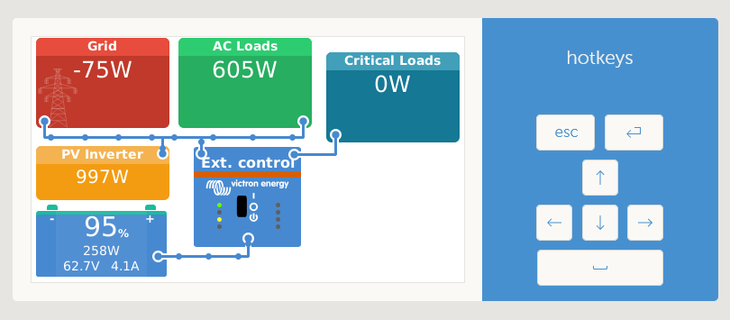
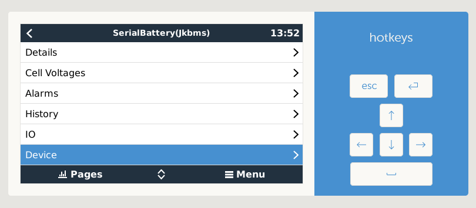
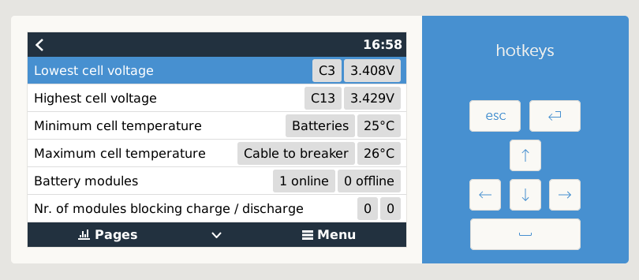
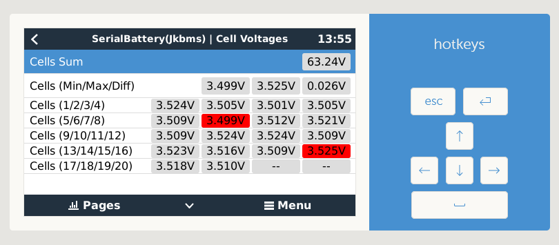
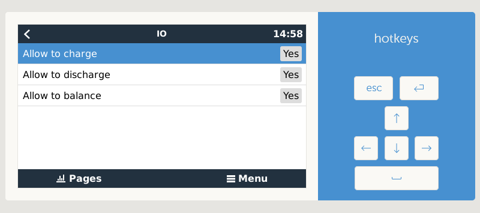
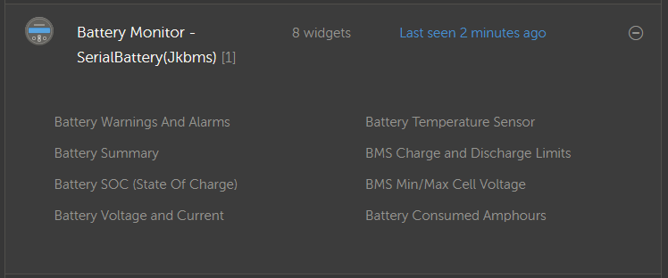
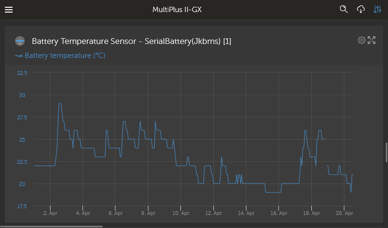
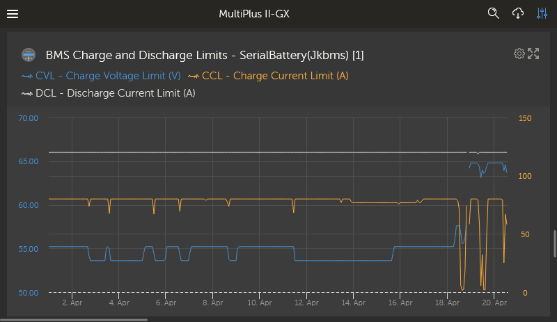

# dbus-serialbattery
This is a driver for VenusOS devices (any GX device sold by Victron or a Raspberry Pi running the VenusOS image).

The driver will communicate with a Battery Management System (BMS) that support serial communication (RS232, RS485 or TTL UART) and publish this data to the VenusOS system. The main purpose is to act as a Battery Monitor in your GX and supply State Of Charge (SOC) and other values to the inverter.

 * [BMS Types supported](https://github.com/Louisvdw/dbus-serialbattery/wiki/BMS-types-supported)
 * [FAQ](https://github.com/Louisvdw/dbus-serialbattery/wiki/FAQ)
 * [Features](https://github.com/Louisvdw/dbus-serialbattery/wiki/Features)
 * [How to install](https://github.com/Louisvdw/dbus-serialbattery/wiki/How-to-install)
 * [Troubleshoot](https://github.com/Louisvdw/dbus-serialbattery/wiki/Troubleshoot)

### Supporting this project:
If you find this driver helpful please considder supporting this project. You can buy me a Ko-Fi or get in contact if you would like to donate hardware.

 or using [Paypal.me](https://paypal.me/innernet)

### Developer Remarks
To develop this project, install the requirements. This project makes use of velib_python which is pre-installed on
Venus-OS Devices under `/opt/victronenergy/dbus-systemcalc-py/ext/velib_python`. To use the python files locally,
`git clone` the [velib_python](https://github.com/victronenergy/velib_python) project to velib_python and add
velib_python to the `PYTHONPATH` environment variable.

#### How it works
* Each supported BMS needs to implement the abstract base class `Battery` from `battery.py`.
* `dbus-serialbattery.py` tries to figure out the correct connected BMS by looping through all known implementations of
`Battery` and executing its `test_connection()`. If this returns true, `dbus-serialbattery.py` sticks with this battery
and then periodically executes `dbushelpert.publish_battery()`. `publish_battery()` executes `Battery.refresh_data()` which
updates the fields of Battery. It then publishes those fields to dbus using `dbushelper.publish_dbus()`
* The Victron Device will be "controlled" by the values published on `/Info/` - namely:
  * `/Info/MaxChargeCurrent `
  * `/Info/MaxDischargeCurrent`
  * `/Info/MaxChargeVoltage`
  * `/Info/BatteryLowVoltage`
  * `/Info/ChargeRequest` (not implemented in dbus-serialbattery)

For more details on the victron dbus interface see [the official victron dbus documentation](https://github.com/victronenergy/venus/wiki/dbus)

## Screenshots

### Venus OS

### VRM Portal

