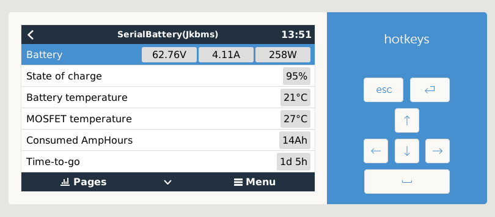
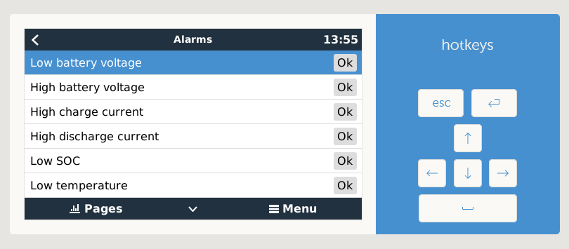
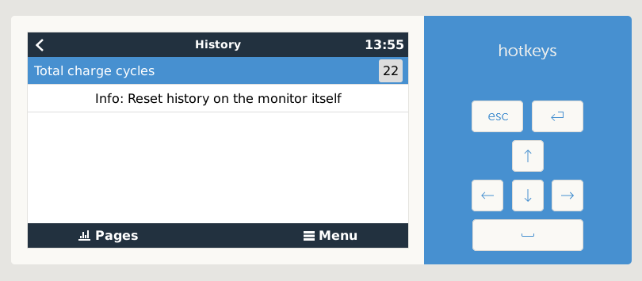
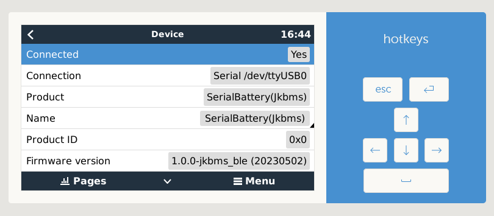
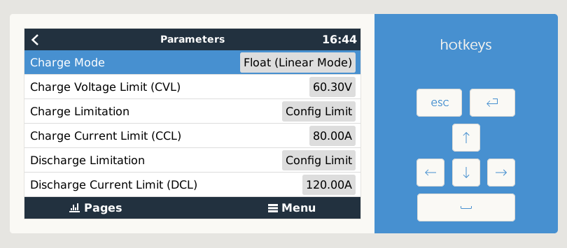
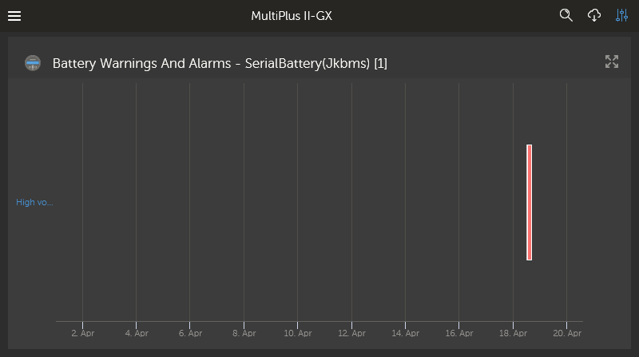
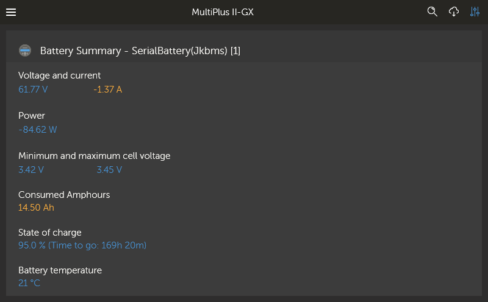
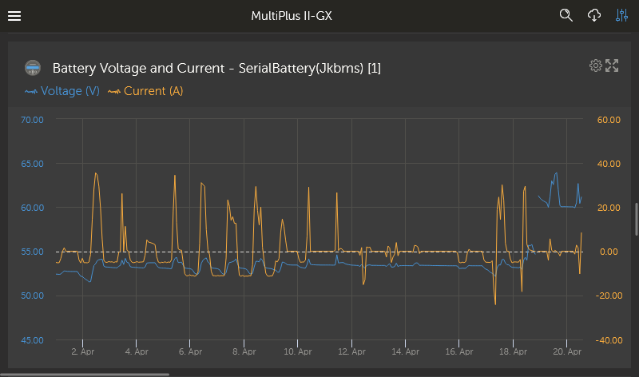
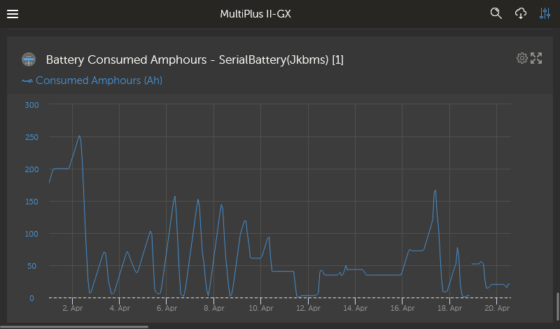

# dbus-serialbattery
This is a driver for Venus OS devices (any GX device sold by Victron or a Raspberry Pi running the Venus OS image).

The driver will communicate with a Battery Management System (BMS) that support serial (RS232, RS485 or TTL UART) and Bluetooth communication (see [BMS feature comparison](https://mr-manuel.github.io/venus-os_dbus-serialbattery/general/features#bms-feature-comparison) for details). The data is then published to the Venus OS system (dbus). The main purpose is to act as a Battery Monitor in your GX and supply State of Charge (SoC) and other values to the inverter/charger.

## History
The first version of this driver was released by [Louisvdw](https://github.com/Louisvdw/dbus-serialbattery) in September 2020.
In February 2023 I (mr-manuel) made my first PR, since Louis did not have time anymore to contribute to this project.
With the release of `v1.0.0` I became the main developer of this project and since then I'm maintaining and updating it.

A big thanks to [Louisvdw](https://github.com/Louisvdw/dbus-serialbattery) for the initiation of this project.

## Support this project
This project takes a lot of time and effort to maintain, answering support requests, adding new features and so on.
If you are using this driver and you are happy with it, please make a donation to support me and this project.

## Documentation

* [Introduction](https://mr-manuel.github.io/venus-os_dbus-serialbattery/)
* [Features](https://mr-manuel.github.io/venus-os_dbus-serialbattery/general/features)
* [Supported BMS](https://mr-manuel.github.io/venus-os_dbus-serialbattery/general/supported-bms)
* [How to install, update, disable, enable and uninstall](https://mr-manuel.github.io/venus-os_dbus-serialbattery/general/install)
* [How to troubleshoot](https://mr-manuel.github.io/venus-os_dbus-serialbattery/troubleshoot/)
* [FAQ](https://mr-manuel.github.io/venus-os_dbus-serialbattery/faq/)

### Developer Remarks
To develop this project, install the requirements. This project makes use of velib_python which is pre-installed on
Venus-OS Devices under `/opt/victronenergy/dbus-systemcalc-py/ext/velib_python`. To use the python files locally,
`git clone` the [velib_python](https://github.com/victronenergy/velib_python) project to velib_python and add
velib_python to the `PYTHONPATH` environment variable.

Make sure the GitHub Actions run fine in your repository. In order to make the GitHub Actions run please select in your repository settings under `Actions` -> `General` -> `Actions permissions` the option `Allow all actions and reusable workflows`. Check also in your repository settings under `Actions` -> `General` -> `Workflow permissions` if `Read and write permissions` are selected. This will check your code for Flake8 and Black Lint errors. [Here](https://py-vscode.readthedocs.io/en/latest/files/linting.html) is a short instruction on how to set up Flake8 and Black Lint checks in VS Code. This will save you a lot of time.

See this checklist, if you want to [add a new BMS](https://mr-manuel.github.io/venus-os_dbus-serialbattery/general/supported-bms#add-by-opening-a-pull-request)

#### How it works
* Each supported BMS needs to implement the abstract base class `Battery` from `battery.py`.
* `dbus-serialbattery.py` tries to figure out the correct connected BMS by looping through all known implementations of
`Battery` and executing its `test_connection()`. If this returns true, `dbus-serialbattery.py` sticks with this battery
and then periodically executes `dbushelpert.publish_battery()`. `publish_battery()` executes `Battery.refresh_data()` which
updates the fields of Battery. It then publishes those fields to dbus using `dbushelper.publish_dbus()`
* The Victron Device will be "controlled" by the values published on `/Info/` - namely:
  * `/Info/MaxChargeCurrent `
  * `/Info/MaxDischargeCurrent`
  * `/Info/MaxChargeVoltage`
  * `/Info/BatteryLowVoltage`
  * `/Info/ChargeRequest` (not implemented in dbus-serialbattery)

For more details on the Victron dbus interface see [the official victron dbus documentation](https://github.com/victronenergy/venus/wiki/dbus)

## Screenshots

### Venus OS

### VRM Portal

