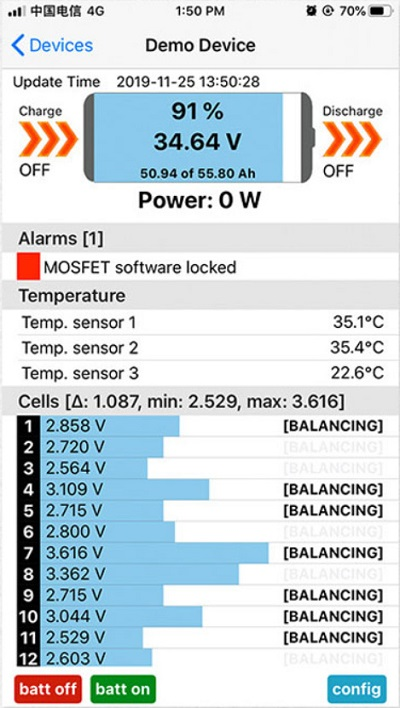

# Supported BMS

## ANT BMS

## ECS GreenMeter with LiPro

## JKBMS / Heltec BMS

## MNB spi BMS
Disabled by default as it requires aditional manual step to install.

## Renogy BMS

## Smart BMS
Including:
* ### [LLT Power](https://www.lithiumbatterypcb.com/product-instructionev-battery-pcb-boardev-battery-pcb-board/ev-battery-pcb-board/smart-bms-of-power-battery/)
* ### [Jiabaida JDB BMS](https://dgjbd.en.alibaba.com/)
* ### Overkill Solar
* ### Other BMS that use the Xiaoxiang phone app

| Android | iOS |
|-|-|
|  |  |

## Smart Daly BMS
Including:
* ### Sinowealth based Daly BMS

## Tian Power (LifePower / Revov)

# Planned support

For a list of requested support for BMS types see the issue list and vote for the next one to be supported
https://github.com/Louisvdw/dbus-serialbattery/issues?q=is%3Aissue+is%3Aopen+label%3Abattery

If you would like to donate hardware or would like to help testing a spesific BMS please get in contact.
