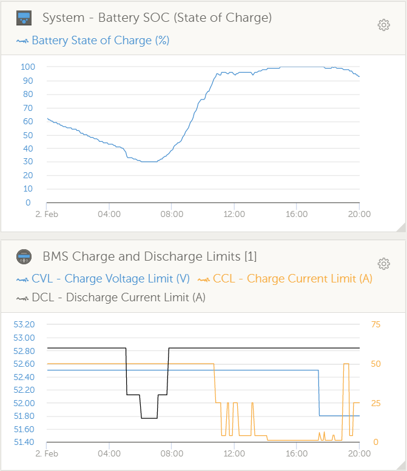

## Features

The driver  can ahndle batteries from 3 to 32 cells. It will act as Battery Monitor inside Venus OS and update the following values:

* Voltage
* Current
* Power
* SoC (State of Charge)
* Battery temperature
* Mosfet temperature
* Consumed Ah
* Time-to-go

* Min/max cell voltages
* Min/max temperature (depending on BMS)
* Installed capacity
* Available capacity

* Cell details (depending on BMS)
  * Min
  * Max
  * Diff
  * Cell voltage 1 - 32

* Raise alarms from the BMS

* History of charge cycles

* Charge current control management (CCCM)

* Set battery parameters (DVCC)
  * Charge Voltage Limit(CVL)
  * Charge Current Limit(CCL)
  * Discharge Current Limit(DCL)
  * CVL (battery bax) automatically adjusted by cell count * 3.45V
  * Battery min automatically adjusted by cell count * 3.1V

## Screenshots

## Charge current control management
CCCM limits the current when the battery is close to full or close to empty.
When your battery is full, the reduced charge current will give the balancers in your BMS time to work
When your battery is close to empty the reduced dicharge current will limit that a sudden large load will pull your battery cells below their protection values.

### Limitation Modes
The limits can be applied in Step or Linear mode.
Step use hard boundaries that will apply recognisable step values and use less processing power (DEFAULT)
Linear will give a gradual change from one limit range to the next.

### CCCM attributes
You can set CCCM limits for 3 attributes which can be Enabled/Disabled and adjusted by settings in utils.py
The smallest limit from all enabled will apply.

### SoC (State of Charge) from the BMS
* `CCCM_SOC_ENABLE = True/False`
* `DCCM_SOC_ENABLE = True/False`

CCCM limits the charge/discharge current depending on the SoC

* between 99% - 100% => 5A charge
* between 95% - 98% => 1/4 Max charge
* between 91% - 95% => 1/2 Max charge

* 30% - 91% => Max charge and Max discharge

* between 20% - 30% => 1/2 Max discharge
* between 10% - 20% => 1/4 Max discharge
* below <= 10% => 5A

### Cell Voltage
* `CCCM_CV_ENABLE = True/False`
* `DCCM_CV_ENABLE = True/False`

CCCM limits the charge/discharge current depending on the highest/lowest cell voltages

* between 3.50V - 3.55V => 2A charge
* between 3.45V - 3.50V => 30A charge
* between 3.30V - 3.45V => 60A

* 3.30V - 3.10V => Max charge and Max discharge (60A)

* between 2.90V - 3.10V => 30A discharge
* between 2.8V - 2.9V => 5A discharge
* below <= 2.70V => 0A discharge

### Temprature

* `CCCM_T_ENABLE = True/False`
* `DCCM_T_ENABLE = True/False`

CCCM limits the charge/discharge current depending on the highest/lowest temperature sensor values
Charging will be 0A if below 0°C or above 55°C
Discharging will be 0A if below -20°C or above 55°C

## Charge voltage control management

### Cell voltage penalty
If the cell voltage reaches a specific value, then subtract a penalty from the CVL.
Detailed info can be found here: https://github.com/Louisvdw/dbus-serialbattery/issues/297#issuecomment-1327142635
### Float voltage emulation
If the `MAX_CELL_VOLTAGE` * `cell count` is reached for `MAX_VOLTAGE_TIME_SEC` then the CVL changes to `FLOAT_CELL_VOLTAGE` * `cell count`. Max voltage could be reached again if the SoC gets under `SOC_LEVEL_TO_RESET_VOLTAGE_LIMIT`.

## Battery feature comparison
| Feature | JBD/LLT | Daly | ANT | MNB | JKBMS | RENOGY | TIAN/LIFE Power | ECS |
| ---: | :---: | :---: | :---: | :---: | :---: | :---: | :---: | :---: |
| Voltage | Yes | Yes | Yes | Yes | Yes | Yes | Yes | Yes |
| Current | Yes | Yes | Yes | Yes | Yes | Yes | Yes | Yes |
| Power | Yes | Yes | Yes | Yes | Yes | Yes | Yes | Yes |
| State Of Charge | Yes | Yes | Yes | Yes | Yes | Yes | Yes | Yes |
| Battery temperature | Yes | Yes | Yes | Yes | Yes | Yes | Yes | Yes |
| Mosfet temperature | Yes | No | No | No | Yes | No | No | No |
| Consumed Ah | Yes | Yes | Yes | Yes | Yes | Yes | Yes | Yes |
| Time-to-go | Calc | Calc | Calc | Calc | Calc | Calc | Calc | Calc |
| Min/max cell voltages | Yes | Yes | Yes | Yes | Yes | Yes | Yes | No |
| Min/max temperature | Yes | Yes | Yes | Yes | Yes | Yes | Yes | Yes |
| Installed capacity | Yes | No | Yes | Yes | Yes | Yes | Yes | Yes |
| Available capacity | Yes | Yes | Yes | Yes | Yes | Yes | Yes | Yes |
| Cell details | ? | ? | ? | ? | Yes | ? | ? | ? |
| Raise alarms from the BMS | Yes | Yes | Yes | Yes | Yes | Yes | Yes | Yes (no cells yet) |
| History of charge cycles | Yes | Yes | Yes | Yes | Yes | Yes | Yes | No |
| Charge current control management (CCCM) | Yes | Yes | Yes | Yes | Yes | Yes | Yes | Yes |
| Set battery parameters (DVCC) | Fixed | Fixed | Fixed | Fixed | Fixed | Fixed | Fixed | Yes |
