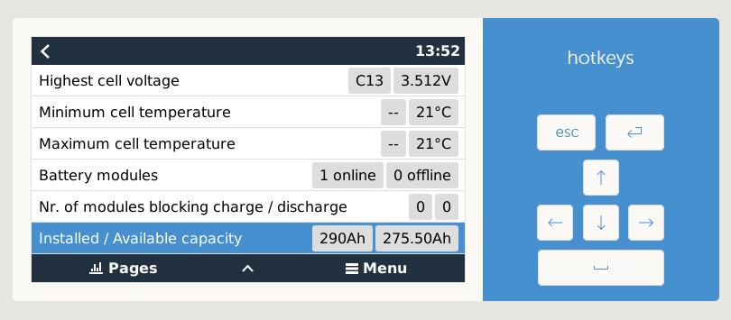

# Features

The driver can handle batteries from 3 to 32 cells. It will act as Battery Monitor inside Venus OS and update the following values:

* Voltage
* Current
* Power
* SoC (State of Charge)
* Battery temperature
* Mosfet temperature
* Consumed Ah
* Time-to-go

* Min/max cell voltages
* Min/max temperature (depending on BMS)
* Installed capacity
* Available capacity

* Cell details (depending on BMS)
  * Min
  * Max
  * Diff
  * Cell voltage 1 - 32

* Raise alarms from the BMS

* History of charge cycles

* Charge current control management (CCCM)

* Set battery parameters (DVCC)
  * Charge Voltage Limit (CVL)
  * Charge Current Limit (CCL)
  * Discharge Current Limit (DCL)
  * CVL (battery max) automatically adjusted by `cell count` \* `3.45V`
  * Battery min automatically adjusted by `cell count` \* `3.1V`

### Screenshots

## Charge current control management
CCCM limits the current when the battery is close to full or close to empty.
When your battery is full, the reduced charge current will give the balancers in your BMS time to work.
When your battery is close to empty the reduced dicharge current will limit that a sudden large load will pull your battery cells below their protection values.

### Limitation modes
The limits can be applied in Step or Linear mode.
* **Step** use hard boundaries that will apply recognisable step values and use less processing power (DEFAULT)
* **Linear** will give a gradual change from one limit range to the next

### CCCM attributes
You can set CCCM limits for 3 attributes which can be enabled / disabled and adjusted by settings in `utils.py` (driver version `<= v0.14.3`) or `config.ini` (driver version `>= v1.0.0`).
The smallest limit from all enabled will apply.

### Cell voltage
* `CCCM_CV_ENABLE = True/False`
* `DCCM_CV_ENABLE = True/False`

CCCM limits the charge/discharge current depending on the highest/lowest cell voltages

* between `3.50V - 3.55V` &rarr; `2A` charge
* between `3.45V - 3.50V` &rarr; `30A` charge
* between `3.30V - 3.45V` &rarr; `60A`

* `3.30V - 3.10V` &rarr; max charge and max discharge (`60A`)

* between `2.90V - 3.10V` &rarr; `30A` discharge
* between `2.8V - 2.9V` &rarr; `5A `discharge
* below `<= 2.70V` &rarr; `0A` discharge

### Temperature

* `CCCM_T_ENABLE = True/False`
* `DCCM_T_ENABLE = True/False`

CCCM limits the charge/discharge current depending on the highest/lowest temperature sensor values
* Charging will be `0A` if below `0°C` or above `55°C`
* Discharging will be `0A` if below `-20°C` or above `55°C`

### SoC (State of Charge) from the BMS
* `CCCM_SOC_ENABLE = True/False`
* `DCCM_SOC_ENABLE = True/False`

CCCM limits the charge/discharge current depending on the SoC

* between `99% - 100%` &rarr; `5A` charge
* between `95% - 98%` &rarr; 1/4 max charge
* between `91% - 95%` &rarr; 1/2 max charge

* `30% - 91%` &rarr; max charge and max discharge

* between `20% - 30%` &rarr; 1/2 max discharge
* between `10% - 20%` &rarr; 1/4 max discharge
* below `<= 10%` &rarr; `5A`

## Charge voltage control management

### Cell voltage penalty
If the cell voltage reaches a specific value, then subtract a penalty from the CVL.
Detailed info can be found here: [CCL/DCL depending on cell-voltage does not turn off charging completely, still overvoltage alarm](https://github.com/Louisvdw/dbus-serialbattery/issues/297#issuecomment-1327142635)

### Float voltage emulation
If the `MAX_CELL_VOLTAGE` \* `cell count` is reached for `MAX_VOLTAGE_TIME_SEC` then the CVL changes to `FLOAT_CELL_VOLTAGE` \* `cell count`. Max voltage could be reached again if the SoC gets under `SOC_LEVEL_TO_RESET_VOLTAGE_LIMIT`.

## BMS feature comparison

| Feature                                                                                  | Ant   | Daly  | ECS                | Heltec | HLPdataBMS4S | JK BMS | Life/Tian Power/Eg4ll | LLT/JBD | MNB (1) | Renogy | Seplos | Sinowealth (1) |
| ---:                                                                                     | :---: | :---: | :---:              | :---:  | :---:        | :---:  | :---:           | :---:   | :---:              | :---:  | :---:  | :---:                     |
| Voltage                                                                                  | Yes   | Yes   | Yes                | Yes    | Yes          | Yes    | Yes             | Yes     | Yes                | Yes    | Yes    | Yes                       |
| Current                                                                                  | Yes   | Yes   | Yes                | Yes    | Yes          | Yes    | Yes             | Yes     | Yes                | Yes    | Yes    | Yes                       |
| Power                                                                                    | Yes   | Yes   | Yes                | Yes    | Yes          | Yes    | Yes             | Yes     | Yes                | Yes    | Yes    | Yes                       |
| State Of Charge                                                                          | Yes   | Yes   | Yes                | Yes    | Yes          | Yes    | Yes             | Yes     | Yes                | Yes    | Yes    | Yes                       |
| Battery temperature                                                                      | Yes   | Yes   | Yes                | Yes    | Yes          | Yes    | Yes             | Yes     | Yes                | Yes    | Yes    | Yes                       |
| MOSFET temperature                                                                       | No    | No    | No                 | Yes    | No           | Yes    | No              | Yes     | No                 | No     | No     | No                        |
| Consumed Ah                                                                              | Yes   | Yes   | Yes                | No     | Yes          | Yes    | Yes             | Yes     | Yes                | Yes    | Yes    | Yes                       |
| Time-to-go                                                                               | Calc  | Calc  | Calc               | Calc   | Calc         | Calc   | Calc            | Calc    | Calc               | Calc   | Calc   | Calc                      |
| Min/max cell voltages                                                                    | Yes   | Yes   | No                 | Yes    | Yes          | Yes    | Yes             | Yes     | No                 | Yes    | Yes    | Yes                       |
| Min/max temperature                                                                      | Yes   | Yes   | Yes                | No     | Yes          | Yes    | Yes             | Yes     | Yes                | Yes    | Yes    | Yes                       |
| Installed capacity                                                                       | Yes   | Yes   | Yes                | Yes    | Yes          | Yes    | Yes             | Yes     | Yes                | Yes    | Yes    | Yes                       |
| Available capacity                                                                       | Yes   | Yes   | Yes                | No     | Yes          | Yes    | Yes             | Yes     | Yes                | Yes    | Yes    | Yes                       |
| Cell details                                                                             | No    | Yes   | Yes                | Yes    | Yes          | Yes    | Yes             | Yes     | No                 | Yes    | Yes    | ?                         |
| Balancing status                                                                         | Yes   | No    | Yes                | Yes    | No           | Yes    | Yes             | No      | No                 | No     | No     | ?                         |
| Raise alarms from the BMS                                                                | Yes   | Yes   | Yes (2) | Yes    | Yes          | Yes    | Yes             | Yes     | Yes                | Yes    | Yes    | ?                         |
| History of charge cycles                                                                 | Yes   | Yes   | No                 | No     | No           | Yes    | Yes             | Yes     | No                 | Yes    | Yes    | Yes                       |
| Get CCL/DCL from the BMS                                                                 | No    | No    | No                 | Yes    | No           | Yes    | No              | No      | No                 | No     | No     | No                        |
| Charge current control management (CCCM)                                                 | Yes   | Yes   | Yes                | Yes    | Yes          | Yes    | Yes             | Yes     | Yes                | Yes    | Yes    | Yes                       |
| Set battery parameters (DVCC)                                                            | Calc  | Calc  | Yes                | Calc   | Yes          | Calc   | Calc            | Calc    | Yes                | Calc   | Calc   | Calc                      |
| Bluetooth connection (3)  | No    | No    | No                 | No     | No           | Yes    | No              | Yes     | No                 | No     | No     | No                        |
| CAN connection (3)                                                            | No    | Yes   | No                 | No     | No           | Yes    | No              | No      | No                 | No     | No     | No                        |

`Calc` means that the value is calculated by the driver.

`?` means that it's unknown, if the value is fetched. It has to be verified. If you know this, please update this page.

(1) Disabled by default. They can be enabled by uncommenting in `dbus-serialbattery.py`.

(2) No cells yet.

(3) The Bluetooth and CAN connections are still not stable on some systems. If you want to have a stable connection use the serial connection.
