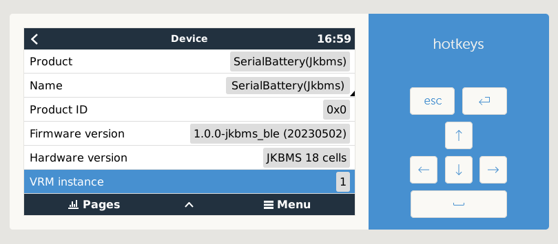

# dbus-serialbattery
This is a driver for Venus OS devices (any GX device sold by Victron or a Raspberry Pi running the Venus OS image).

The driver will communicate with a Battery Management System (BMS) that support serial (RS232, RS485 or TTL UART) and Bluetooth communication (see [BMS feature comparison](https://louisvdw.github.io/dbus-serialbattery/general/features#bms-feature-comparison) for details). The data is then published to the Venus OS system (dbus). The main purpose is to act as a Battery Monitor in your GX and supply State of Charge (SoC) and other values to the inverter/charger.

### Supporting this project
If you find this driver helpful please consider supporting this project. You can buy me a Ko-Fi or get in contact, if you would like to donate hardware for development.

### Support [Louisvdw](https://github.com/Louisvdw)
* Main developer
* Added most of the BMS drivers

 or using [Paypal.me](https://paypal.me/innernet)

### Support [mr-manuel](https://github.com/mr-manuel)
* Added a lot of features, optimizations and improvements with `v1.0.x`
* Added a lot of documentation to the config file and notes that are displayed after installation for better understanding
* Introduced the new documentation page of the driver and reworked a great part of it for easier understanding

## Requirements

* GX device or Raspberry Pi running Venus OS version `v2.80` or later.

## Screenshots

### Venus OS

### VRM Portal

