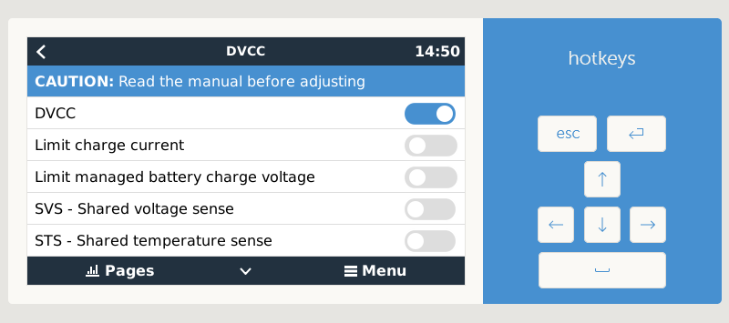

# How to install, update, disable, enable and uninstall

## 🚨 NB! Before you begin

> The driver does not do any setup of your BMS/battery. You need to have a working battery before you start.

> From the driver release `v0.12` you need to be running Venus OS `v2.80` or higher.

> Note! The current version require Venus OS `v2.91` or `v2.92`. Else you will see a white screen after the install. I will remove this note when that issue is fixed.

The driver currently implement some hard limits. Make sure your device is set up correctly and can handle these limits before you install.

 * `50A` charge (to change this see [How to change the default limits](#how-to-change-the-default-limits))
 * `60A` discharge (to change this see [How to change the default limits](#how-to-change-the-default-limits))
 * `2.9V` min cell voltage
 * `3.45V` max cell voltage

The cell voltages is used along with the cell count to set the battery voltage (e.g. for 16cells your battery min voltage will be `3.1 * 16 = 49.6V` and max coltage `3.45 * 16 = 55.2V`


## Settings for your BMS/battery

You need to first set up your BMS hardware to match your cells. You would do this, if you build you own battery or your manufacturer/installer have done this for you.
The important steps:

 * Use the same cells (type, branch and capacity) and make sure they are balanced.
 * You need to correctly set your battery capacity to match the cells you are using. Your SoC calculation in your BMS will be wrong otherwise. If you use `120Ah` cells then your battery capacity will be `120Ah` etc.
 * You need to correctly set your min/max cell protection voltages. These are voltages when your BMS will disconnect to protect your cells like `2.85V` and `3.65V`. Your driver limits should be between these and NOT the same.

## Settings for your GX device

1. You need to have a Venus OS device set up and running on your GX system (VenusGX, Cerbo, Raspberry Pi, etc.) and connected to your inverter.
In [VRM](https://vrm.victronenergy.com/) look under the device list for your installation. If you can see the Gateway (GX) and Ve.Bus System (inverter) then your GX is ready.

2. On your GX device you should set DVCC On. This will enable your battery to request charge parameters. All the Share Sense option can be Off. If your battery works with lower limits, enable Limit Charge Current, Limit managed battery Charge Voltage and set the lower values as required. You can also enable Limit inverter power for Discharge Current limit under ESS. These settings will be remembered between updates.


3. You also need to connect your BMS to the Venus OS device using a serial interface. Use the cable for your BMS or a Victron branded USB&rarr;RS485 or USB&rarr;Ve.Direct (RS232) cable for best compatibility. Most FTDI/FT232R/CH340G USB&rarr;serial also works. The FT232R and CH340G already has a driver included in the Venus OS.

  > 🚨 **NB! Only connect Rx & Tx or A & B to the BMS,** if you are NOT using an isolated ([galvanic isolation](https://en.wikipedia.org/wiki/Galvanic_isolation)) cable or adapter. This prevents the current to flow through the adapter, if the BMS cuts the ground. Else it will destroy your BMS, GX device or Raspberry Pi.

## Install or update

### Installation video

[](https://www.youtube.com/watch?v=Juht6XGLcu0)

### Install automatically with flash drive/SD

> CerboGX users cannot use the the automatic installer. Use SSH option instead.

1. Download and copy the [latest release](https://github.com/Louisvdw/dbus-serialbattery/releases) `venus-data.tar.gz` to the root of a USB flash drive that is in FAT32 format (a SD card is also an option for GX devices, but not for Raspberry Pi).

2. Plug the flash drive/SD into the Venus device and reboot. It will automatically extract and install to the correct locations and try the driver on any connected devices.

3. Reboot the GX (in the Remote Console go to `Settings` &rarr; `General` &rarr; `Reboot?`).


### Install over SSH

> Require [root access](https://www.victronenergy.com/live/ccgx:root_access)

1. Log into your Venus OS device using a SSH client like Putty or bash.

2. Run these commands to install or update to the latest release version.

  ```bash
  wget -O /tmp/installrelease.sh https://raw.githubusercontent.com/Louisvdw/dbus-serialbattery/master/etc/dbus-serialbattery/installrelease.sh

  bash /tmp/installrelease.sh

  reboot
  ```


### Install over SSH: specific version/testing option

> Require [root access](https://www.victronenergy.com/live/ccgx:root_access)

1. Log into your Venus OS device using a SSH client like Putty or bash.

2. Download [the version you need](https://github.com/Louisvdw/dbus-serialbattery/releases) using the command below replacing the URL with the link to the `venus-data.tar.gz` version you need.

  ```bash
  wget REPLACE_WITH_URL_TO_VENUS_DATA_TAR_GZ
  ```

3. Run this script command to install the update from the same location.

  ```bash
  tar -zxf venus-data.tar.gz -C /data

  reboot
  ```


### Install over SSH: nightly version/beta test

> Require [root access](https://www.victronenergy.com/live/ccgx:root_access)

> This version is installed directly from the repository and can contain errors. Not recommended for production environments unless you know what you do.

```bash
wget -O /tmp/install-nightly.sh https://raw.githubusercontent.com/Louisvdw/dbus-serialbattery/jkbms_ble/etc/dbus-serialbattery/install-nightly.sh && bash /tmp/install-nightly.sh
```

Select `2` for `jkbms_ble`.

### BMS specific settings

* ECS BMS &rarr; https://github.com/Louisvdw/dbus-serialbattery/issues/254#issuecomment-1275924313


## How to change the default limits

The driver currently use a fixed upper current limit for the BMS:

* `50A` charge
* `60A` discharge

If you require more current and your battery can handle that, you can make changes to the source code for that (note that any updates will override this change with driver version `<= v0.14.3`)

```ini
MAX_BATTERY_CURRENT = 50.0
MAX_BATTERY_DISCHARGE_CURRENT = 60.0
```

If you use the cell voltage limits, temperature limits or SoC limits you also need to adjust their values to match the new current, else CCL and DCL will not change. See also in the [FAQ](../faq#why-is-the-chargingdischarging-current-limit-ccldcl-smaller-than-the-set-one).

### Settings location/path

💡 After updating the settings reboot the device or run `/data/etc/dbus-serialbattery/reinstalllocal.sh` to apply the changes.

#### Driver version `<= v0.14.3`
Edit `/data/etc/dbus-serialbattery/utils.py` to update the constants.

#### Driver version `>= v1.0.0`
Copy the values from `/data/etc/dbus-serialbattery/config.default.ini` to `/data/etc/dbus-serialbattery/config.ini` you want to change. All options can also be copied from [here](https://github.com/Louisvdw/dbus-serialbattery/blob/jkbms_ble/etc/dbus-serialbattery/config.default.ini).

## How to edit `utils.py` or `config.ini`

There are two ways to edit the files. You can edit them:

1. Inside the GX device/Raspberry Pi over SSH
2. On your PC and then copy only the `utils.py` or `config.ini` over to the GX device/Raspberry Pi

### SSH edit using Nano editor (recommended)

Log into your GX device/Raspberry Pi using SSH and run this command. Replace `FILE_NAME` with the file name you want to edit.

```bash
nano /data/etc/dbus-serialbattery/FILE_NAME
```

You can use the arrow keys to scroll down and edit the values you need.

Use `Ctrl + O` (O like Oskar) to save and `Ctrl + X` to exit the editor.

### Copy edited file from PC to GX device/Raspberry Pi

You can edit the file in a plain text editor on you PC like Notepad (Windows) or TextEdit (macOS). Then you need a program that can do SFTP like [FileZilla](https://filezilla-project.org/download.php?show_all=1) (Windows/macOS/Linux), [WinSCP](https://winscp.net/eng/downloads.php) (Windows) or [Cyberduck](https://cyberduck.io/download/) (macOS).

Connect to your GX using the same login as with SSH and copy your edited file over the existing one at `/data/etc/dbus-serialbattery/utils.py` or `/data/etc/dbus-serialbattery/config.ini`.

⚠️ Sometimes it happens, that the line endings get changed from `LF` to `CRLF` with this method. Check the [FAQ --> `$'\r': command not found` or `syntax error: unexpected end of file`](../faq#r-command-not-found-or-syntax-error-unexpected-end-of-file) to solve.

> Don't copy all the files as the required file permissions will be destroyed and your driver might fail to start.

## How to enable a disabled BMS
If your BMS is disabled by default, you have to enable it to get it working.

💡 See also [How to edit `utils.py` or `config.ini`](#how-to-edit-utilspy-or-configini) if you don't know how to edit a file.

#### Driver version `<= v0.14.3`
Edit `/data/etc/dbus-serialbattery/utils.py` and uncomment (remove the `#` as first line character) your BMS.

E.g.

```python
#    {"bms" : "Sinowealth"},
```
becomes

```python
    {"bms" : "Sinowealth"},
```

Edit `/data/etc/dbus-serialbattery/dbus-serialbattery.py` and check, if your BMS is already uncommented (without the `#` as first line character) your BMS.

#### Driver version `>= v1.0.0`
Edit `/data/etc/dbus-serialbattery/dbus-serialbattery.py` and uncommented (without the `#` as first line character) your BMS twice (`# from ...` and `# {"bms": ...}`).


## Disable the driver
You can disable the driver so that it will not be run by the GX device. To do that run the following command in SSH.

```bash
bash /data/etc/dbus-serialbattery/disabledriver.sh
```

You also need to configure your MPPTs to run in `Stand alone mode` again. Follow the Victron guide for [Err 67 - BMS Connection lost](https://www.victronenergy.com/live/mppt-error-codes#err_67_-_bms_connection_lost).

## Enable the driver
To enable the driver again you can run the installer.

```bash
bash /data/etc/dbus-serialbattery/reinstalllocal.sh
```

## Uninstall/remove the driver

To uninstall/remove the driver run the uninstall script. The script is included from driver version `> v0.14.3`.

```bash
bash /data/etc/dbus-serialbattery/uninstall.sh
```

To uninstall/remove previous driver versions `<= v0.14.3` run this commands.

```bash
# handle read only mounts
sh /opt/victronenergy/swupdate-scripts/remount-rw.sh

# remove files, don't use variables here, since on an error the whole /opt/victronenergy gets deleted
rm -rf /data/conf/serial-starter.d
rm -rf /opt/victronenergy/service/dbus-serialbattery
rm -rf /opt/victronenergy/service-templates/dbus-serialbattery
rm -rf /opt/victronenergy/dbus-serialbattery

# kill if running
pkill -f "python .*/dbus-serialbattery.py"

# remove install-script from rc.local
sed -i "/sh \/data\/etc\/dbus-serialbattery\/reinstalllocal.sh/d" /data/rc.local
```

> If after the uninstall for some reason several items in the GUI were red, DO NOT reboot your GX device. See [Uninstalling driver bricked my cerbo #576](https://github.com/Louisvdw/dbus-serialbattery/issues/576)
