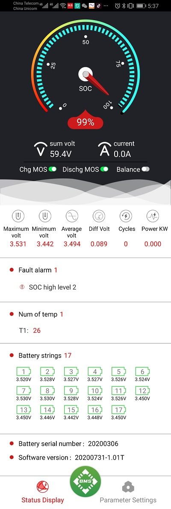
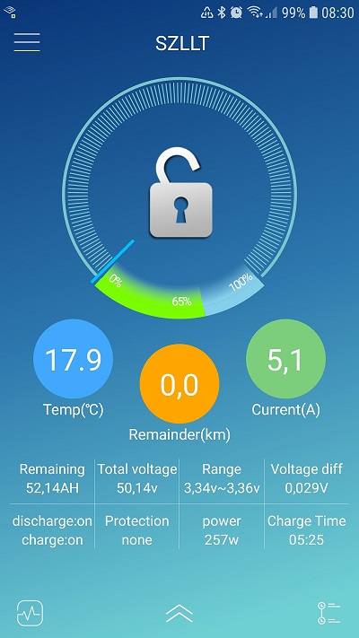
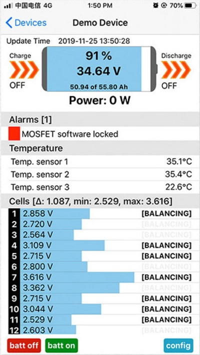

# Supported BMS

## Currently supported
### &bull; ANT BMS
Disabled by default since driver version `v1.0.0` as it causes other issues. More informations can be found in [Add other use case (grid meter) or ignore devices - ANT BMS check missing](https://github.com/Louisvdw/dbus-serialbattery/issues/479) and if it was fixed. See [How to enable a disabled BMS](../general/install#how-to-enable-a-disabled-bms) to enable the BMS.

### &bull; Daly Smart BMS
Including:
#### - Sinowealth based Daly BMS
Disabled by default since driver version `v0.14.0` as it causes other issues. See [How to enable a disabled BMS](../general/install#how-to-enable-a-disabled-bms) to enable the BMS.

### &bull; ECS GreenMeter with LiPro

### &bull; HLPdataBMS4S

### &bull; [JKBMS](https://www.jkbms.com/products/) / Heltec BMS

### &bull; Life/Tian Power
Including:

#### - Revov

### &bull; MNB spi BMS
Disabled by default as it requires additional manual steps to install.

### &bull; Renogy BMS

### &bull; Seplos
So far only tested on version `16E`.

### &bull; Smart BMS
Including:
#### - [LLT Power](https://www.lithiumbatterypcb.com/product-instructionev-battery-pcb-boardev-battery-pcb-board/ev-battery-pcb-board/smart-bms-of-power-battery/)
#### - [Jiabaida JDB BMS](https://dgjbd.en.alibaba.com/)
#### - Overkill Solar
#### - Other BMS that use the Xiaoxiang phone app

| Android | iOS |
|-|-|
|  |  |

## Planned support

You can view the current [BMS requests](https://github.com/Louisvdw/dbus-serialbattery/discussions/categories/new-bms-requests) to see which BMS support is requested and vote for the BMS you want to be supported.

## Add/Request new BMS
There are two possibilities to add a new BMS.

### Add by opening a pull request
Fork the repository and use the [`battery_template.py`](https://github.com/Louisvdw/dbus-serialbattery/blob/dev/etc/dbus-serialbattery/bms/battery_template.py) as template to add a new battery. As soon as the BMS works you can open a pull request (PR) to merge it. Please use the `dev` branch for adding your BMS/feature and opening the PR.

Here is a short checklist that should help you:

  - [ ] Add your battery class and battery class import in alphabetical order in the [`etc/dbus-serialbattery/battery.py`](https://github.com/Louisvdw/dbus-serialbattery/blob/dev/etc/dbus-serialbattery/battery.py)
  - [ ] Add your BMS to the [BMS feature comparison](https://louisvdw.github.io/dbus-serialbattery/general/features#bms-feature-comparison) page by editing [`docs/docs/general/features.md`](https://github.com/Louisvdw/dbus-serialbattery/blob/dev/docs/docs/general/features.md)
  - [ ] Add your BMS to the [Supported BMS](https://louisvdw.github.io/dbus-serialbattery/general/supported-bms) page by editing [`docs/docs/general/supported-bms.md`](https://github.com/Louisvdw/dbus-serialbattery/blob/dev/docs/docs/general/supported-bms.md)
  - [ ] Do not import wildcards `*`
  - [ ] If your BMS don't run with the default settings add installation notes to the [How to install, update, disable, enable and uninstall](https://louisvdw.github.io/dbus-serialbattery/general/install#bms-specific-settings) [`docs/docs/general/install.md`](https://github.com/Louisvdw/dbus-serialbattery/blob/dev/docs/docs/general/install.md)
  - [ ] If your BMS needs custom settings that the user should be able to change, add it below the `; --------- BMS specific settings ---------` section in the [`etc/dbus-serialbattery/config.default.ini`](https://github.com/Louisvdw/dbus-serialbattery/blob/dev/etc/dbus-serialbattery/config.default.ini)
  - [ ] Make sure the GitHub Actions run fine in your repository. In order to make the GitHub Actions run please select in your repository settings under `Actions` -> `General` -> `Actions permissions` the option `Allow all actions and reusable workflows`. Check also in your repository settings under `Actions` -> `General` -> `Workflow permissions` if `Read and write permissions` are selected. This will check your code for Flake8 and Black Lint errors. [Here](https://py-vscode.readthedocs.io/en/latest/files/linting.html) is a short instruction on how to set up Flake8 and Black Lint checks in VS Code. This will save you a lot of time.

### Request by opening a discussion
Start a [new discussion](https://github.com/Louisvdw/dbus-serialbattery/discussions/new?category=new-bms-requests) in the `New BMS request` category. Please add also the protocol documentation which you can request from the manufacturer/seller. The more upvotes the BMS request has, the higher is the priority.

If you would like to donate hardware or would like to help testing a specific BMS please get in contact over the [discussions section](https://github.com/Louisvdw/dbus-serialbattery/discussions).

## Which BMS are you using?
Please let us know, which BMS you are using with the driver by upvoting your BMS: [Which BMS are you using?](https://github.com/Louisvdw/dbus-serialbattery/discussions/546)
