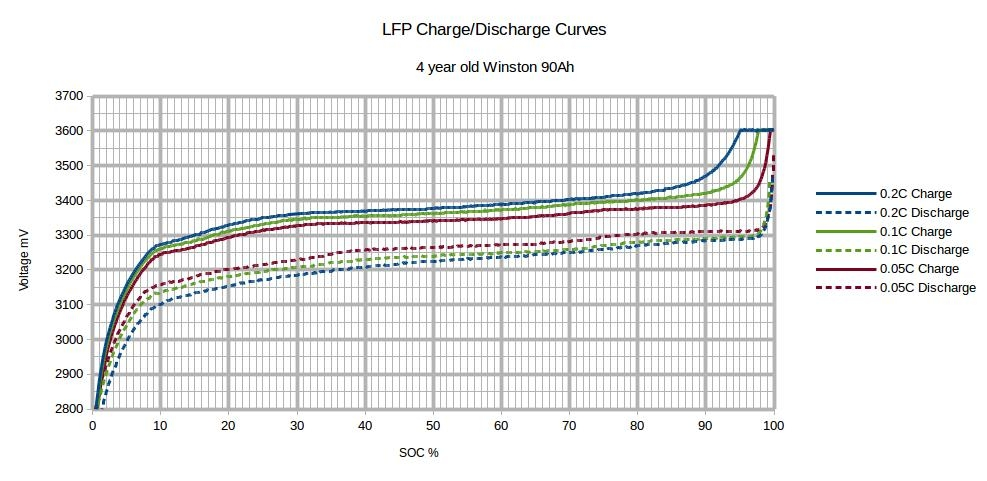

# FAQ (Frequently Asked Questions)

## Why do I need a BMS for lithium batteries?
Lithuim cells are great at storing energy, but they can be dangerous. An overcharged cell can cause a fire. A Battery Management System (BMS) first priority is to protect the cells in your battery from any potential hazards.

The BMS will prevent your battery reaching an unsafe situation (it will disconnect the charge or discharge) and help with the state of each cell inside the battery so that your battery will last longer.


## Which BMS should I buy?
Most of the BMS that the driver support will work fine and the driver does support most features for all the BMS brands. See the [comparison table](../general/features#bms-feature-comparison) for any small differenaces.

Find the BMS that fits your budget with the features that you need.

The balancers on Smart Daly BMS don't seem to work that well so many users have opted to add an external balancer to help with that.

Also the way that Daly implemented their communication protocol gives for a much slower data retrial which means slower response to events by the driver.

If you own a Daly, then it will work just fine, but if you still need to buy your BMS then one of the other supported BMS would be a better choice.


## Which serial adapter/cable should I use?
Most USB serial adapters and cables should work fine. You need to use the adapter for the UART type that your BMS use, which is normally TTL, RS232, RS485 or even SPI.

Those adapters based on the **FDTI** or **CH340** chips are the easiest to use because the GX opperating system already include drivers for them. Also make sure, that your adapter is isolated ([galvanic separated](https://en.wikipedia.org/wiki/Galvanic_isolation)). This prevents the current to flow through the adapter, if the BMS cuts the ground. Else it will destroy your BMS, GX device or Raspberry Pi.

Cable preferences:

1. Best option is the UART cable/box for your BMS. These use connectors matching your BMS and minimise potential problems with errors from loose connections.
2. Isolated ([galvanic separated](https://en.wikipedia.org/wiki/Galvanic_isolation)) cables. These are more expensive, but have electrical protection built in making them safer.
3. Any adapter that work with your BMS UART.


## Which UART connection is the best to use (TTL/RS232/RS485)?
The driver works the same with all the supported UART types. Most BMS will use the `3.3V` TTL (which some would lable as UART) and/or RS485 (`5V`). Victron's VE.Direct is RS232 (`12V`), but not many BMS use that.

You need to match the UART type with what your BMS support.

If the Bluetooth module for your BMS use the UART, then you will need to remove that to plug in your USB adapter, if you do not have another UART available. After your initial setup you do not need the Bluetooth, but you will not be able to connect to it with the phone app.


## Do I need a SmartShunt as well?
No you don't. All BMS do measure the total battery voltage and most do use a shunt to do that already.

The Smartshunt is very well build and most likely better calibrated, but it can only measure the total battery voltage and the current input/output. There are no sensors for the cells inside the battery so the Smartshunt have much less information to work with.

It is best to let the BMS be the Battery Monitor.

You can add both to your system and in the newer Venus OS firmwares you can select to upload both values to the VRM cloud.


## Can the driver be used as monitor only?

> Please also read [Should I set the Smartshunt or the BMS as the Battery Monitor?](../troubleshoot/faq#should-i-set-the-smartshunt-or-the-bms-as-the-battery-monitor)

Yes it can, but there are certain limitations.

### Venus OS `< v3.00`
Select another or `No battery monitor` in the remote console under `Settings -> System setup -> Battery monitor` and disable `DVCC` in the remote console under `Settings -> DVCC`.

The `DVCC` has to be disabled since Venus OS selects the first BMS available in Venus OS `< v3.00`. Pay attention, that in this case also other BMS cannot control the charger (CVL, CCL, DCL). Please consider to upgrade to the latest Venus OS version in this case.

### Venus OS `>= v3.00`
Select another or `No battery monitor` in the remote console under `Settings -> System setup -> Battery monitor` and another or `No BMS control` in the remote console under `Settings -> DVCC -> Controlling BMS`.

## Should I set the Smartshunt or the BMS as the Battery Monitor?
Set the BMS as the Battery Monitor of your system so that it can read the alarm and cell data to manage your GX system. If you don't, then these alarms will be ignored and the system will keep on (dis)charging the battery even if a problem alarm is raised. The BMS will react by disconnecting the battery for protection and your inverter will go offline.


## Why is the max cell voltage set to `3.45V`?
Most home power systems use LiFePo4 cells that are `3.2V`. This explanation is the same but with different voltages for a `3.7V` cell system.

The default `MAX_CELL_VOLTAGE` and `MIN_CELL_VOLTAGE` that is set in the driver is to get your battery to full charge without any cell going into protection. This is used to calculate the max voltage for the battery that we ask the chargers to charge the battery too.

`3.65V` will be the protection voltage of a cell for most BMS while `3.45V` is considered full charge.

If you set your charger to aim for `3.65V` it means you are aiming to reach the protection voltage (which it will, and raise an alert). Even `3.64V` is too close.

If you look at your cells you will see that it takes hours of charging to go from `3.2V` to `3.4V`, but from `3.45V` to `3.6+V` can be in just a second. This give no time for balancing to kick in, thus one cell will reach `3.65V` while most of the rest will still be around `3.45V` (assuming all your cells are closely balanced. This is much worse if they are not). This all gets multiplied by the cell count that you have.

An example might help (using a 8 sell batery):

* If we aim for `3.45V` per cell that will tell the charger to charge to `27.60V` (`3.45V x 8`)
* If we aim for `3.64V` per cell that will tell the charger to charge to `29.12V` (`3.64V x 8`)

Now say all our cells are almost full. That would mean they are close to `3.45V` or `27.6V` while we are requesting the battery to go up to `29.12V` or another `1.52V`.

The first cell that is a bit more full than the rest will jump from `3.45V` to `3.65V` and raise an alarm, but it is only an increase of `0.2V` which mean while one cell should be protected we are asking the charger to increase the voltage another `1.32V` cause it thinks we are not full yet.

If this continues the BMS will disconnect and your power will trip.

Now, if you still do want to aim for `3.65V` per cell you will have to change the setting on your BMS so that the BMS protection only kick in at a higher voltage (e.g. `3.85V`), but I WOULD NOT RECOMMEND THIS, if you want your battery to last a long time.

You get most of the power from the cells between `3.1V - 3.45V` and you will have less issues.




## Why is the charging/discharging current limit (CCL/DCL) smaller than the set one?
### Driver version `<= v0.14.3`
Check in the `utils.py`, if you have set one of this to true. If yes, then you also have to change the corresponding limits.

* `CCCM_CV_ENABLE = True` then modify the highest value (60) `MAX_CHARGE_CURRENT_CV = [0, 2, 30, 60]` to the same value or bigger as `MAX_BATTERY_CHARGE_CURRENT`
* `DCCM_CV_ENABLE = True` then modify `MAX_DISCHARGE_CURRENT_CV = [0, 5, 30, 60]`
* `CCCM_T_ENABLE = True` then modify `MAX_CHARGE_CURRENT_T = [0, 28, 60, 60, 28, 0]`
* `DCCM_T_ENABLE = True` then modify `MAX_DISCHARGE_CURRENT_T = [0, 28, 60, 60, 28, 0]`

### Driver version `> v0.15.3`
The limits are based on percentages of `MAX_CHARGE_CURRENT_CV` and `MAX_DISCHARGE_CURRENT_CV` values, so there is no need for additional modifications.


## Does the driver work for `3.7V` based cells also?
Yes, but you will [need to adjust](../general/install#how-to-change-the-default-limits) the `MAX_CELL_VOLTAGE` and `MIN_CELL_VOLTAGE` values for `3.7V` cells instead of the default `3.2V` cells.

Recommended values for `3.7V` cells are:

```ini
MAX_CELL_VOLTAGE = 4.0
MIN_CELL_VOLTAGE = 3.6
```


## Why do I get a Low Voltage alarm?

> Not elaborated completely, in the meanwhile see infos below

* [Low Battery Voltage Alarm if /Info/MaxDischargeCurrent = 0](https://github.com/Louisvdw/dbus-serialbattery/issues/407)
* [Undervoltage alarm - why?](https://github.com/Louisvdw/dbus-serialbattery/issues/363)


## Why is DCL jumping from/to `0`?

> Not elaborated completely, in the meanwhile see infos below

* [DCL is "jumping" - should be 0 ?! - JKBMS](https://github.com/Louisvdw/dbus-serialbattery/issues/371)

What is happening is that as soon as no more current is drawn the cell values starts to recover and the BMS release (the charger should only kick in when you are below the min SoC value you have set in the ESS settings).

What helped me here was reducing the Cut-off voltages in the ESS asisstant (there are 4 voltages for different currents) - when the battery voltage dropped to this cut-off voltage, the discharging will stop and the "sustain voltage" will jump in until the battery voltage rises up over the "above-cut-off" value.

Important!!! - When the ESS asisstant is activated, all the 3 "DC input low voltage" settings under the "Inverter" tab are completely ignored by the MP2.

**How to solve this:**
1. Current setting `> 0` (but I did not test this)
2. Reducing the ESS "Cut-off voltage" like I mentioned above


## Why do I get a High Voltage alarm?
If you receive High Voltage alarms that would indicate your battery is:

1. Not set up correctly and you are using the wrong charge voltages
2. It has cell imbalance issues

So asuming you have set the max battery voltage for what the battery require, you then need to help the battery to get the cells balanced. You do that by  lowering the max voltage to a level where you don’t get high voltage alarms anymore and then slowly over a few weeks you can increase the max voltage to where it should be. This will give the balancers time to work.

In your GX settings go to the DVCC menu and activate the "Limit managed battery charge voltage" feature and lower the "Maximum Charge Voltage".
Drop your voltage to `0.2V` lees that normal and then increase it every day by `0.05V` if you did not get a High Voltage alarm during the previous day. If you did get an alarm leave it unchanged for another day.

Do this until you get to the original max charge voltage for your battery.

This will be much faster to do if you use the Keep Batteries changed in ESS option while you are doing this.

Balancing works when ever 1 cell go above the balance threshold, so you are trying to find the battery voltage where that one cell is above the threshold but below the high voltage alarm (e.g. `3.45V - 3.65V`) and then giving the balancers time to work down the high cell with the small balance currents (`50mA` to `200mA`).


## Why is the battery current inverted?
Some Daly BMS send the current as inverted value. This can be correted by setting `INVERT_CURRENT_MEASUREMENT` to `-1`.


## What can I do, if the BMS communication is unstable?

Most unstable communications arise due to:

* Cabeling: Check your cables again and make sure that all solder points are making good connection.
* Missing shielded cable: If the connection gets unstable on greater battery currents and your serial cable is near or along the battery cable, then try to use a shielded cable.
* Damaged/Defective serial adapters: Try another serial adapter.
* Cheap USB Hubs: Make sure you are using a qualitative USB Hub with enough power.
* Raspberry Pi: Do not use a charger for powering the Raspberry Pi. Instead buy a power supply with enough power.


## Fix white screen after install
Normally this will happen, if you were on an older firmware for your GX.

You can remove the GUI changes or update your GX firmware to solve this.


### Remove GUI changes
```bash
cp -f /opt/victronenergy/gui/qml/PageBattery.qml.backup /opt/victronenergy/gui/qml/PageBattery.qml
reboot
```


### Update to the latest firmware
```bash
/opt/victronenergy/swupdate-scripts/check-updates.sh -update -force
```


## How many USB to serial adapters can I connect?
It seems that the Victron GX device has a limit of maximum 8 USB to serial adapters. See [Serial battery driver not found if other VE.direct-USB devices are present](https://github.com/Louisvdw/dbus-serialbattery/issues/422)
